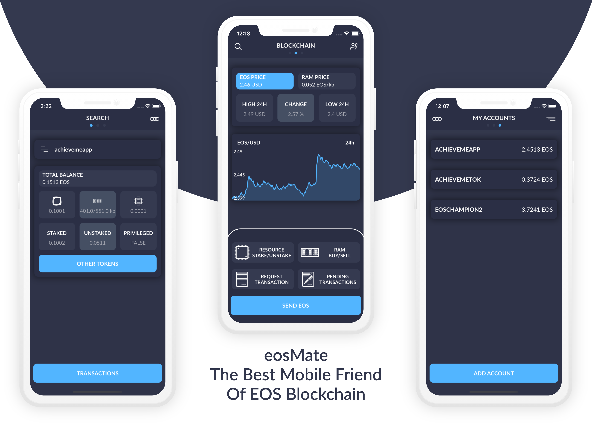

# eosMate - Interacting with EOS in a mobile-friendly way
eosMate iOS app - [Landing page](https://eosmate.io/)

## About

EOS ecosystem is not mobile-friendly. Transactions cannot simply be authorised by users from a mobile device. Users also do not have a simple way of requesting transaction from other EOS accounts. eosMate is here to fix all mobile related problems and bring the best mobile experience for interacting with the blockchain from a mobile device. eosMate comes with a developer-friendly way of interacting with the blockchain. Simply register a new account with us and you can start sending transactions to users mobile devices e.g from your DApp.

## Features

### Wallet
Store securely private keys on the device. Send tokens to other accounts. Everything from the mobile client.

### Request Transactions
As a developer, you can send transactions to sign to the mobile client. As a user, you can send transaction requests to other accounts.

### Toolkit
Stake your accounts CPU, NET or buy RAM. Explore blockchain accounts, see history of transactions, amount of stake and other tokens that the account have. That and so much more. :)

### Observer
When an account is added to the App its EOS amount is automatically being observed by our server. If the amount has changed the clients are getting notified.

[Read more](https://eosmate.io/)  

## Download
[App Store](https://apps.apple.com/us/app/id1425706416) 

## Install

### Project setup
This code is tested on Xcode 14.2. 
1) Install pods by running `pod install` in the repository. 
2) Create a Secrets.swift file, add `struct Secrets` and add `static let firebaseAPIKey` with the API key of the Firebase or an empty string
(Optional) - Running with Firebase
3) Create a Firebase project and add the GoogleService-Info.plist to the `SupportingFiles` folder and set the `firebaseAPIKey` in the created secrets file

To run the project without Firebase just comment the `FirebaseApp.configure()` in the `AppDelegate`.

### Contributions

PRs, suggestions, issues are very welcomed. 🙏

## Licence
The source code is owned and maintained by eosMate s.r.o / [Cyril Cermak](https://www.linkedin.com/in/cyril-cermak-210a8b6b/). 
The code is open sourced under the MIT license. The images and graphics is opened under Creative Commons By-Attribution license.
